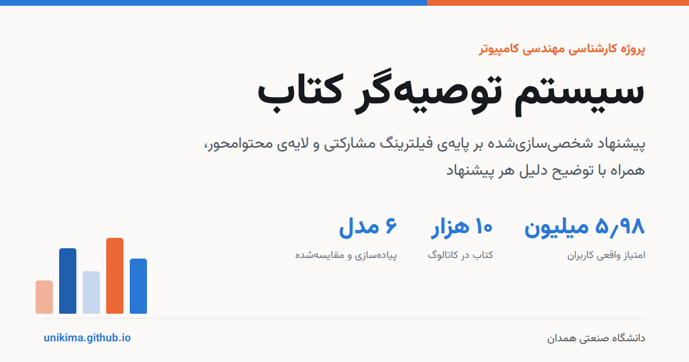

# سیستم توصیه‌گر کتاب

طراحی و پیاده‌سازی سیستم توصیه‌گر کتاب بر اساس سلیقه کاربر، با رویکرد
ترکیبی فیلترینگ مشارکتی و محتوامحور.

**نسخه‌ی زنده: <https://unikima.github.io/>**

سایت هیچ بک‌اندی ندارد؛ مدل‌های آموزش‌دیده به فایل‌های دودویی فشرده
(حدود ۹ مگابایت) تبدیل می‌شوند و کل محاسبه‌ی توصیه در مرورگر انجام
می‌گیرد.

## اجرا از صفر

```bash
pip install -r requirements.txt   # ۱. نصب پیش‌نیازها
python download_data.py           # ۲. دانلود دیتاست goodbooks-10k (یک‌بار)
python -m src.train               # ۳. آموزش مدل‌ها (حدود ۷ دقیقه)
python -m src.export_web          # ۴. استخراج مدل‌ها برای مرورگر
cd web && npm install && npm run dev   # ۵. اجرای رابط کاربری
```

پس از گام پنجم سایت روی `http://localhost:3000` بالا می‌آید.

رابط اولیه‌ی Streamlit به‌عنوان نسخه‌ی پشتیبان در `app.py` باقی مانده
است (`streamlit run app.py`)، اما رابط اصلی پروژه همان نسخه‌ی `web/` است.

## ساختار پروژه

```
book-recommender/
├── src/
│   ├── config.py                همه‌ی پارامترهای قابل تنظیم
│   ├── data_loader.py           خواندن، پاک‌سازی و تقسیم داده
│   ├── evaluate.py              معیارهای ارزیابی و بوت‌استرپ
│   ├── tuning.py                جاروب پارامترها روی داده اعتبارسنجی
│   ├── plots.py                 تولید نمودارهای ارزیابی
│   ├── train.py                 اسکریپت آموزش
│   ├── export_web.py            استخراج ماتریس‌های مدل برای مرورگر
│   └── models/
│       ├── base.py              رابط مشترک مدل‌ها
│       ├── popularity.py        مدل پایه (محبوبیت)
│       ├── item_knn.py          فیلترینگ مشارکتی آیتم‌محور
│       ├── matrix_factorization.py   تجزیه ماتریس با بایاس
│       ├── pure_svd.py          PureSVD — موتور رتبه‌بندی
│       ├── content_based.py     مدل محتوامحور TF-IDF
│       └── hybrid.py            مدل ترکیبی
├── web/                         رابط کاربری Next.js (بدون بک‌اند)
├── data/                        دیتاست خام (تولیدی)
├── artifacts/                   مدل‌های آموزش‌دیده (تولیدی)
├── results/                     جدول‌ها و نمودارهای ارزیابی (تولیدی)
├── app.py                       رابط کاربری Streamlit (پشتیبان)
└── requirements.txt
```

سه پوشه‌ی «تولیدی» در مخزن نگهداری نمی‌شوند و با اجرای گام‌های بالا
ساخته می‌شوند.

## مدل‌های پیاده‌سازی‌شده

۱. **محبوبیت** — خط مبنا؛ میانگین هموارشده‌ی بیزی برای پیش‌بینی و تعداد خواننده برای رتبه‌بندی.
۲. **شباهت آیتم‌محور (KNN)** — شباهت کسینوسی بین کتاب‌ها با مرکزی‌سازی و کوچک‌سازی.
۳. **تجزیه ماتریس (FunkSVD)** — یادگیری بردارهای پنهان با گرادیان کاهشی تصادفی.
۴. **PureSVD** — تجزیه‌ی مقادیر منفرد روی ماتریس کامل؛ موتور رتبه‌بندی.
۵. **محتوامحور (TF-IDF)** — شباهت متنی عنوان، نویسنده و برچسب‌ها؛ حل‌کننده‌ی شروع سرد.
۶. **ترکیبی** — جمع وزن‌دار استانداردشده‌ی PureSVD و محتوامحور با وزن تطبیقی.

## ارزیابی

| گروه | معیار |
|---|---|
| پیش‌بینی امتیاز | RMSE، MAE |
| کیفیت رتبه‌بندی | Precision@10، Recall@10، NDCG@10 |
| تنوع | Coverage |

داده به سه بخش آموزش (۷۰٪)، اعتبارسنجی (۱۰٪) و آزمون (۲۰٪) تقسیم
می‌شود؛ تنظیم پارامترها فقط روی بخش اعتبارسنجی انجام می‌گیرد. برای
معیارهای رتبه‌بندی بازه‌ی اطمینان ۹۵ درصد با بوت‌استرپ روی کاربران
محاسبه می‌شود. جدول کامل نتایج پس از اجرای `src.train` در
`results/comparison.csv` ذخیره می‌شود.

## تنظیم پارامترها

همه‌ی پارامترها در `src/config.py` جمع شده‌اند. برای تغییر تعداد
عامل‌های پنهان یا وزن مدل ترکیبی، همان فایل را ویرایش کنید و دوباره
`python -m src.train` را اجرا کنید.

## انتشار

خروجی پروژه کاملاً ایستاست و روی هر میزبان فایل ساکنی بالا می‌آید.
گردش‌کار `.github/workflows/deploy.yml` با هر push سایت را می‌سازد و
روی GitHub Pages منتشر می‌کند. راهنمای رابط وب در `web/README.md` است.
